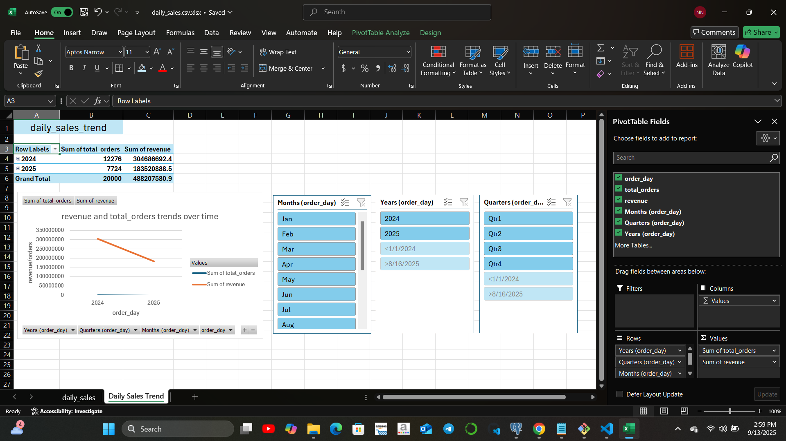
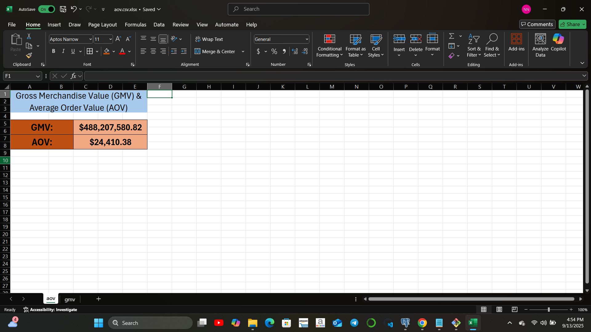

# OmniCart Analytics 

## Elevator Pitch

Analyzed 50K+ synthetic e‑commerce records to extract business insights (sales, top products, cohorts, marketing ROI) and presented them in dashboards. Employers can either use the ready SQLite file for quick demo or import the CSVs into PostgreSQL for a production-like setup.

## Repository Structure

- `dashboards/`
  - `raw/` – Excel dashboards
  - `screenshots/` - screenshots

- `data/`
  - `CSVs for each table_postgresql` – CSVs for each table (orders, products, customers, etc.)
  - `SQLite` – SQLite snapshot of the database

- `exports/`
  - Aggregated CSV outputs for dashboards

- `sql/`
  - `analysis` – SQL queries
  - `clean` - cleaning scripts
  - `ddl` - Postgres DDL scripts (create tables)

- `README.md`

## Dataset: Omnicart

This project uses the **Omnicart dataset**, which I generated and prepared for analytics.  
Since the dataset is large, it is also hosted on Google Drive.

🔗 [Download Omnicart Dataset (Google Drive)](https://drive.google.com/drive/folders/19DejW6NuJCdVa4RiwLuDpgO7SMtWQV2R?usp=drive_link)

### Dataset Contents
The Google Drive folder contains:
- `customers.csv` → Customer details  
- `orders.csv` → Orders information  
- `order_items.csv` → Items per order  
- `products.csv` → Product catalog  
- `payments.csv` → Payment transactions  
- `returns.csv` → Returns data  
- `suppliers.csv` → Supplier information  
- `inventory.csv` → Inventory levels  
- `marketing_campaigns.csv` → Campaign data  
- `web_sessions.csv` → Web analytics sessions  
- `data_dictionary.csv` → Field descriptions for all tables  
- `omnicart.db` → Preloaded SQLite database file (alternative to CSVs)

### For PostgreSQL users:

- Check sql/ddl/ for schema creation scripts
- Check data/ for CSV files to load into tables
- Check sql/analysis/ for example queries and insights
- Run a quick test:
``` 
psql -d omnicart -c "SELECT COUNT(*) FROM orders;"
```
### For SQLite users (quick demo):

- Open the SQLite snapshot:
``` 
sqlite3 sqlite/omnicart.db
```
- Run a quick test:
```
SELECT COUNT(*) FROM orders;
``` 

### Backup & Restore (safe data handling)

Before running cleaning or transformations, you can back up the database.
Backup:
```
 pg_dump -d omnicart -f omnicart_before_clean.sql
```
Restore:
```
 psql -d omnicart -f omnicart_before_clean.sql
```
- Or simply re-import from the CSVs if needed.

## Process

### Data Cleaning (do these once to save time later)

To ensure consistent and reliable analysis, cleaning SQL scripts are included:

- Folder: sql/clean/
- Run in order: 01_parse_types.sql → 02_nulls_defaults.sql → … → 07_create_clean_tables.sql
- What they do:
   - Cast dates & numeric columns
   - Fill NULLs with defaults
   - Trim and standardize IDs
   - Deduplicate rows
   - Check referential integrity

- Run these after importing CSVs into PostgreSQL.

### How to run

- From project root in bash:
```
 psql -d omnicart -f sql/clean/01_parse_types.sql
 psql -d omnicart -f sql/clean/02_nulls_defaults.sql
 ...
```
- Or run all in one go:
```
 for f in sql/clean/*.sql; do
  psql -d omnicart -f "$f"
 done
```

## Analysis Previews

- Here, I’ve included snapshots of my analysis results (from PostgreSQL,Excel).
- For full SQL code, please visit: sql/analysis/

**Daily Orders and Daily Revenue**
- From PostgreSQL query:  
  

- From Excel dashboard:  
  

**Category Performance (by Month)**
- From PostgreSQL query:  
  

- From Excel dashboard:  
    

**Gross Merchandise Value (GMV) & Average Order Value (AOV)**  
- GMV (Gross Merchandise Value) = $ 48,82,07,580.82
- AOV (Average Order Value) = $ 24,410.38 
    